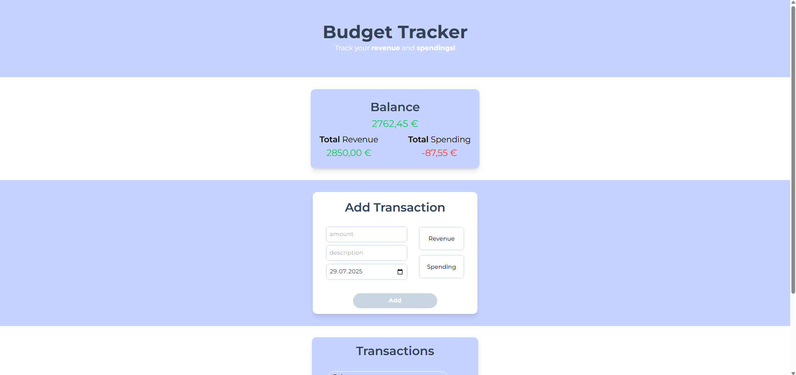
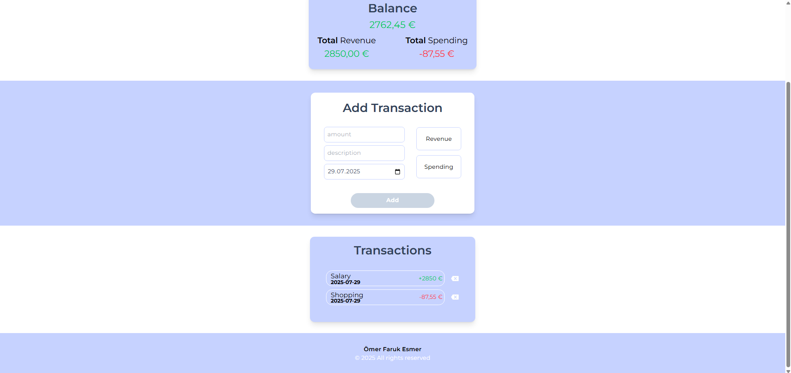

# Budget Tracker
Welcome to the Budget Tracker! This is a clean and simple web application for managing personal finances. As my third self-developed JavaScript project, it was built to practice and solidify core concepts like DOM manipulation, state management, and local data persistence.

## Features
- **Add Transactions:** Easily add income (revenue) and expenses (spending) with an amount, date, and description.
- **Dynamic Overview:** Automatic calculation and display of the total balance, total revenue, and total spending.
- **Visual Feedback:** Color-coding for positive amounts (green) and negative amounts (red) provides a quick and clear overview.
- **Delete Transactions:** Each transaction can be individually removed from the list.
- **Data Persistence:** The transaction list is saved in the browser's Local Storage. This ensures your data remains available even after closing or reloading the page.
- **Input Validation:** The form checks if all necessary information (amount, type, date, description) has been entered before a transaction can be added.
- **User-Friendly Form:** The "Add Transaction" button is disabled as long as the inputs are invalid. The form is automatically reset after each successful entry.
## Technologies used
- HTML5
- TailwindCSS
- Vanilla JavaScript

## Screenshots

 
